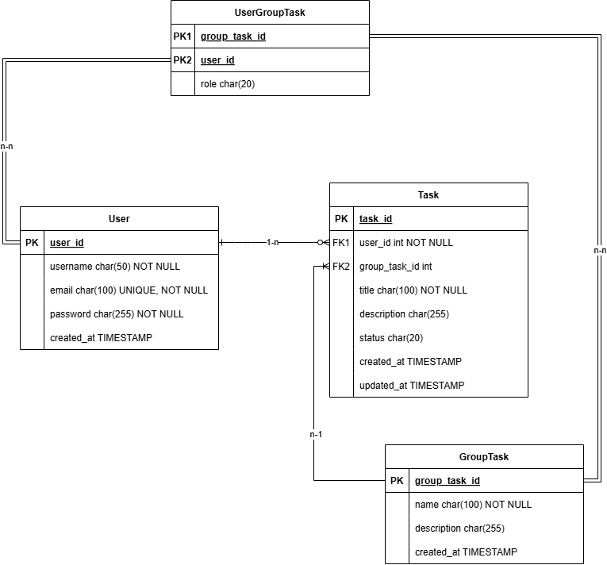

# Taskify

## 1. Overview

Taskify is a task management system that supports organizing tasks in collaborative groups. It allows users to create and manage tasks, assign them to specific groups, and define roles for each user within a group.

## 2. System Architecture

The system follows a backend RESTful architecture, with clear domain boundaries between users, groups, and tasks. It supports user-group relationships through a join table with role-based permissions.

## 3. Data Architecture

### 3.1 Database Schema (ERD)

### 3.2 Relationships
- **User–Task**: One-to-many. A user can create multiple tasks.
- **GroupTask–Task**: One-to-many. A task belongs to one group.
- **User–GroupTask**: Many-to-many. Users can belong to multiple groups with roles (via `UserGroupTask`).
- **UserGroupTask**: Join table with additional `role` field to represent the user's role in the group.

### 3.3 Field Details
#### User

| Field       | Type          | Constraints                  |
|-------------|---------------|------------------------------|
| user_id     | PK            | Auto-increment or UUID       |
| username    | char(50)      | NOT NULL                     |
| email       | char(100)     | UNIQUE, NOT NULL             |
| password    | char(255)     | Hashed, NOT NULL             |
| created_at  | TIMESTAMP     | Default: current timestamp   |

#### GroupTask

| Field        | Type          | Constraints                  |
|--------------|---------------|------------------------------|
| group_task_id| PK            | Auto-increment or UUID       |
| name         | char(100)     | NOT NULL                     |
| description  | char(255)     | Optional                     |
| created_at   | TIMESTAMP     | Default: current timestamp   |

#### Task

| Field         | Type           | Constraints                  |
|---------------|----------------|------------------------------|
| task_id       | PK             | Auto-increment or UUID       |
| user_id       | FK -> User     | NOT NULL                     |
| group_task_id | FK -> GroupTask| NOT NULL                     |
| title         | char(100)      | NOT NULL                     |
| description   | char(255)      | Optional                     |
| status        | char(20)       | e.g., "open", "in-progress", "done" |
| created_at    | TIMESTAMP      | Default: current timestamp   |
| updated_at    | TIMESTAMP      | Updated on modification      |

#### UserGroupTask

| Field         | Type         | Constraints                |
|---------------|--------------|----------------------------|
| group_task_id | FK -> GroupTask | Composite PK          |
| user_id       | FK -> User      | Composite PK          |
| role          | char(20)        | e.g., "admin", "member" |
## 4. Interface Design

### 4.1 API Design (REST)

#### User API

| Method | Endpoint   | Description       | Request Body                    | Response        |
| ------ | ---------- | ----------------- | ------------------------------- | --------------- |
| GET    | /users     | Get all users     | -                               | List of users   |
| GET    | /users/:id | Get a user by ID  | -                               | User object     |
| POST   | /users     | Create a new user | username, email, password       | Created user    |
| PUT    | /users/:id | Update a user     | username, email, password (opt) | Updated user    |
| DELETE | /users/:id | Delete a user     | -                               | Success message |

#### GroupTask API

| Method | Endpoint    | Description         | Request Body      | Response        |
| ------ | ----------- | ------------------- | ----------------- | --------------- |
| GET    | /groups     | Get all group tasks | -                 | List of groups  |
| GET    | /groups/:id | Get a group by ID   | -                 | Group object    |
| POST   | /groups     | Create a new group  | name, description | Created group   |
| PUT    | /groups/:id | Update a group      | name, description | Updated group   |
| DELETE | /groups/:id | Delete a group      | -                 | Success message |

#### Task API

| Method | Endpoint   | Description       | Request Body                                       | Response        |
| ------ | ---------- | ----------------- | -------------------------------------------------- | --------------- |
| GET    | /tasks     | Get all tasks     | -                                                  | List of tasks   |
| GET    | /tasks/:id | Get a task by ID  | -                                                  | Task object     |
| POST   | /tasks     | Create a new task | title, description, status, user_id, group_task_id | Created task    |
| PUT    | /tasks/:id | Update a task     | title, description, status                         | Updated task    |
| DELETE | /tasks/:id | Delete a task     | -                                                  | Success message |

#### UserGroupTask API (for user-group assignments)

| Method | Endpoint                       | Description                      | Request Body | Response          |
| ------ | ------------------------------ | -------------------------------- | ------------ | ----------------- |
| POST   | /groups/:groupId/users/:userId | Assign user to group with role   | role         | Assignment object |
| DELETE | /groups/:groupId/users/:userId | Remove user from group           | -            | Success message   |
| GET    | /groups/:groupId/users         | Get all users in a group         | -            | List of users     |
| GET    | /users/:userId/groups          | Get all groups a user belongs to | -            | List of groups    |

### 4.2 Postman Usage
